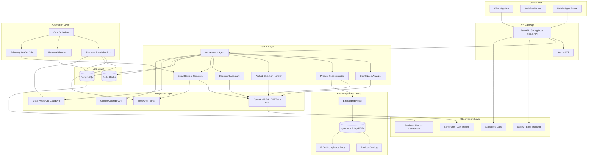
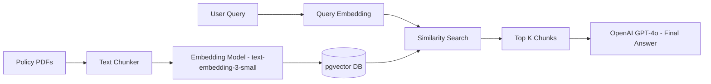
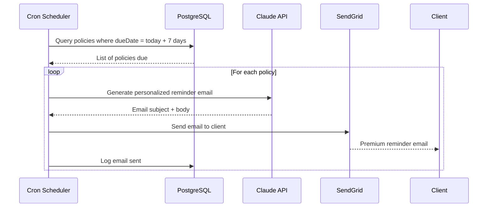
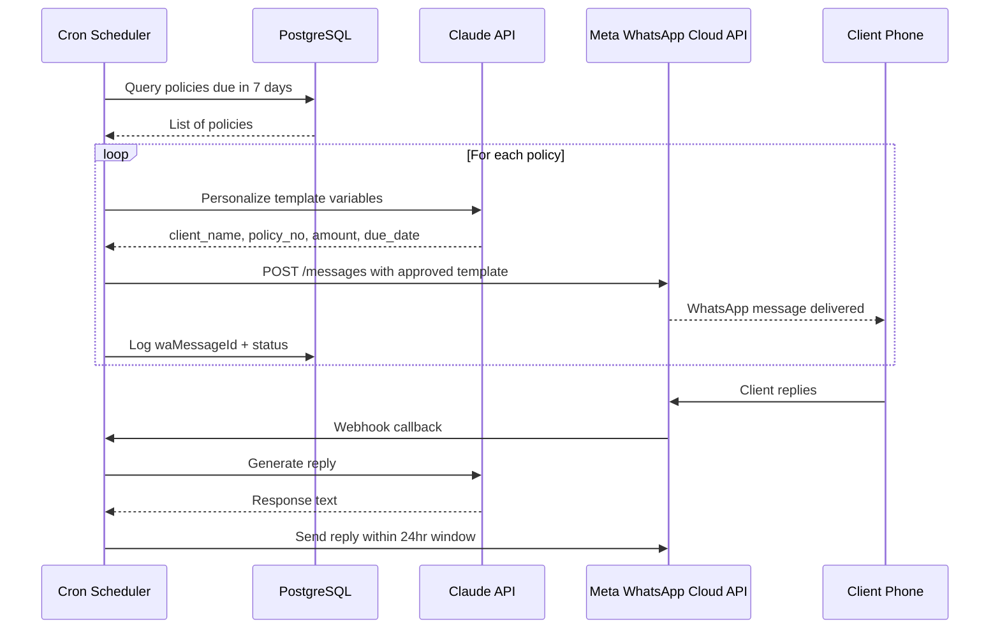
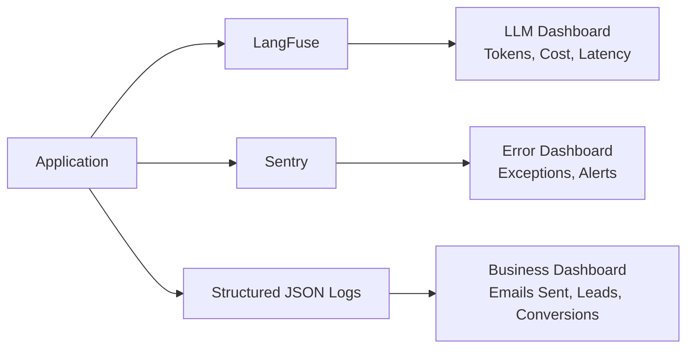
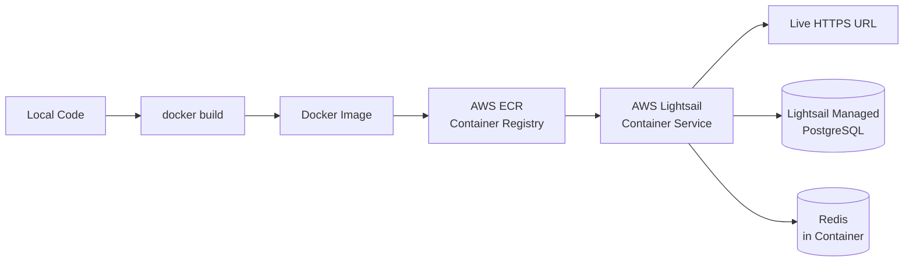

# Insurance Advisor AI — Architecture Plan

> **Target User:** Insurance advisors/agents (not insurance companies)
> **Goal:** Help advisors in daily routine — lead management, product recommendation, client communication, and premium reminders

---

## 1. High-Level Architecture



---

## 2. Detailed Component Breakdown

### 2.1 Client Layer

| Component | Technology | Purpose |
|---|---|---|
| Web Dashboard | React / Next.js | Advisor's main workspace |
| WhatsApp Bot | Meta WhatsApp Cloud API | Quick queries on the go |
| Mobile App | React Native (Phase 3) | Future |

---

### 2.2 API Gateway

```
POST /api/v1/analyze-client        → Client need analysis
POST /api/v1/recommend-products    → Product recommendation
POST /api/v1/generate-pitch        → Sales pitch generator
POST /api/v1/draft-email           → Email content generation
POST /api/v1/document-summary      → Policy PDF summarizer
GET  /api/v1/leads                 → Lead listing
POST /api/v1/leads                 → Add new lead
GET  /api/v1/renewals/upcoming     → Upcoming renewals
POST /api/v1/whatsapp/webhook      → Meta WhatsApp webhook receiver
```

---

### 2.3 Core AI Modules

#### Module 1 — Client Need Analyzer
```
Input:  Age, income, family size, existing policies, goals, risk appetite
Output: Insurance gap analysis + priority recommendations
LLM:    GPT-4o
RAG:    Product catalog + IRDAI guidelines
```

#### Module 2 — Product Recommender
```
Input:  Client profile + need analysis output
Output: Top 3 product recommendations with comparison table
LLM:    GPT-4o
RAG:    Policy PDFs from multiple insurers
```

#### Module 3 — Pitch & Objection Handler
```
Input:  Client objection (e.g., "premium is too high")
Output: Suggested response for advisor
LLM:    GPT-4o
Mode:   Role-play simulation
```

#### Module 4 — Email Content Generator
```
Input:  Client name, policy details, due date, advisor name
Output: Personalized email body (subject + content)
LLM:    GPT-4o-mini
Trigger: Manual or Cron scheduler
```

#### Module 5 — Document Assistant
```
Input:  Uploaded PDF (policy document)
Output: Key highlights, exclusions, claim process summary
LLM:    GPT-4o
RAG:    Chunked PDF embeddings
```

---

### 2.4 Data Models

```sql
-- Advisors
advisors (id, name, email, phone, licenseNo, createdAt)

-- Clients / Leads
clients (id, advisorId, name, age, income, familySize,
         riskAppetite, goals, status, createdAt)

-- Policies
policies (id, clientId, insurerId, productName, policyNo,
          premiumAmount, nextDueDate, expiryDate, type)

-- Interactions
interactions (id, clientId, type, notes, outcome, createdAt)

-- Email Logs
email_logs (id, clientId, policyId, subject, sentAt,
            openedAt, status)

-- WhatsApp Logs
whatsapp_logs (id, clientId, policyId, templateName,
               sentAt, status, waMessageId)
```

---

### 2.5 RAG Pipeline



---

### 2.6 Email Trigger Flow



---

### 2.7 WhatsApp Reminder Flow (Meta Cloud API)



---

### 2.8 Meta WhatsApp Cloud API — Key Details

| Item | Detail |
|---|---|
| **Free tier** | 1,000 service conversations/month |
| **Utility messages** (premium reminders) | Requires pre-approved template |
| **Template approval** | Submit to Meta, takes 1–2 days |
| **Outbound limit** | Cannot initiate without approved template |
| **24-hour window** | Free-form replies only within 24hrs of client message |
| **Indian numbers** | Works with +91 numbers directly |

**Sample approved template:**
```
Hi {{1}}, your policy {{2}} premium of ₹{{3}} 
is due on {{4}}. Please pay to avoid lapse.
Contact your advisor for help.
```

**Code example:**
```python
import requests

def send_whatsapp_reminder(phone, client_name, policy_no, amount, due_date):
    url = f"https://graph.facebook.com/v18.0/{PHONE_NUMBER_ID}/messages"

    payload = {
        "messaging_product": "whatsapp",
        "to": f"91{phone}",
        "type": "template",
        "template": {
            "name": "premium_reminder",
            "language": {"code": "en"},
            "components": [{
                "type": "body",
                "parameters": [
                    {"type": "text", "text": client_name},
                    {"type": "text", "text": policy_no},
                    {"type": "text", "text": str(amount)},
                    {"type": "text", "text": due_date}
                ]
            }]
        }
    }

    headers = {"Authorization": f"Bearer {ACCESS_TOKEN}"}
    response = requests.post(url, json=payload, headers=headers)
    return response.json()
```

---

### 2.9 Observability Setup



| What to Track | Tool | Metrics |
|---|---|---|
| LLM calls | LangFuse | Token usage, latency, cost per call |
| Errors | Sentry | Exceptions, failed API calls |
| Emails | SendGrid Dashboard | Sent, opened, bounced |
| WhatsApp | Meta Dashboard | Delivered, read, failed |
| Business | Custom (Grafana Phase 2) | Leads, renewals, conversions |
| Scheduler | Application logs | Jobs run, failures |

---

## 3. Technology Stack

| Layer | Technology | Reason |
|---|---|---|
| Backend | Java Spring Boot or Python FastAPI | Your Java expertise; FastAPI for rapid AI iteration |
| LLM | OpenAI GPT-4o / GPT-4o-mini | Strong reasoning; GPT-4o for complex tasks, GPT-4o-mini for simple ones |
| Embeddings | OpenAI text-embedding-3-small | Fast, cheap, accurate |
| Vector DB | PostgreSQL + pgvector | No separate infra needed |
| Primary DB | PostgreSQL | Relational data, policy records |
| Cache | Redis | Session, frequent queries |
| Email | SendGrid | Reliable, good free tier |
| WhatsApp | Meta WhatsApp Cloud API (free tier) | Official, free 1000 conv/month, no middleman |
| Scheduler | Java @Scheduled / APScheduler | Built-in, no extra infra |
| LLM Observability | LangFuse (open source) | Free, self-hostable |
| Error Tracking | Sentry | Free tier sufficient |
| Frontend | React + Next.js | Modern, fast |
| Hosting | AWS Lightsail | Fixed cost, Docker native, Mumbai region |

---

## 4. Phased Rollout Plan

### Phase 1 — Core MVP (Weeks 1–6) ✅ COMPLETE
- [x] Client need analyzer
- [x] Product recommendation (RAG with 5–10 policy PDFs)
- [x] Basic lead management (CRUD)
- [x] Email reminder with cron scheduler
- [x] LangFuse + Sentry integration
- [x] Simple web dashboard (Next.js — 4 screens)

### Phase 2 — Enrich (Weeks 7–12)
- [ ] WhatsApp bot via Meta WhatsApp Cloud API
- [ ] Pre-approved premium reminder template (Meta approval)
- [ ] Human-in-the-loop email/WhatsApp approval before sending
- [ ] Objection handling role-play
- [x] Document summarizer (PDF upload)
- [x] Business metrics dashboard

### Phase 3 — Scale (Months 4–6)
- [ ] Multi-insurer product catalog (live scraping or APIs)
- [ ] Mobile app
- [ ] Multi-advisor support (team accounts)
- [ ] Advanced analytics: conversion rates, advisor performance
- [ ] MCP / Multi-agent if workflows demand it

---

## 5. When to Add MCP & Multi-Agent

| Feature | When to Add | Why |
|---|---|---|
| **MCP** | Phase 3 | Only if integrating live insurer portals or third-party tools |
| **Multi-Agent** | Phase 3 | Only if workflows span lead + product + compliance simultaneously |
| **Human-in-Loop** | Phase 2 | Advisor approves AI-generated messages before sending |

**Rule:** Start with single LLM + RAG. Complexity should be driven by real user pain, not architecture enthusiasm.

---

## 6. Folder Structure (Python FastAPI)

```
insurance-advisor-ai/
├── app/
│   ├── api/
│   │   ├── routes/
│   │   │   ├── clients.py
│   │   │   ├── recommendations.py
│   │   │   ├── emails.py
│   │   │   ├── whatsapp.py
│   │   │   └── documents.py
│   ├── core/
│   │   ├── llm.py              # Claude API client
│   │   ├── rag.py              # RAG pipeline
│   │   ├── embeddings.py       # Embedding logic
│   │   └── observability.py    # LangFuse setup
│   ├── modules/
│   │   ├── need_analyzer.py
│   │   ├── product_recommender.py
│   │   ├── pitch_handler.py
│   │   ├── email_generator.py
│   │   ├── whatsapp_handler.py
│   │   └── doc_assistant.py
│   ├── scheduler/
│   │   ├── premium_reminder.py
│   │   ├── renewal_alert.py
│   │   └── followup_drafter.py
│   ├── models/
│   │   ├── client.py
│   │   ├── policy.py
│   │   ├── email_log.py
│   │   └── whatsapp_log.py
│   └── db/
│       ├── postgres.py
│       └── vector_store.py
├── data/
│   └── policies/               # Uploaded PDFs
├── tests/
├── .env
├── requirements.txt
└── docker-compose.yml
```

---

## 7. Features

### 7.1 Core Features by Module

#### Module 1 — Client Need Analyzer
- Input client profile (age, income, family, goals, risk appetite)
- Generate insurance gap analysis
- Identify underinsured areas
- Priority-based recommendation list

#### Module 2 — Product Recommender
- Top 3 product suggestions per client
- Side-by-side comparison table
- Plain language pros/cons
- Premium estimate per product
- Powered by RAG on policy PDFs

#### Module 3 — Pitch & Objection Handler
- Role-play simulator — advisor vs client
- AI suggests best response to objections
- Pre-built objection library ("too expensive", "already have one", "will think later")
- Personalized pitch scripts per client profile

#### Module 4 — Lead Management
- Add / view / update leads
- Track lead status (new → contacted → interested → converted)
- Follow-up reminders
- Interaction history per client

#### Module 5 — Premium Reminder (Automated)
- Auto-detect policies due in 7/15/30 days
- Send reminder via Email (SendGrid)
- Send reminder via WhatsApp (Meta Cloud API)
- Pre-approved WhatsApp template
- Delivery & read status tracking

#### Module 6 — Document Assistant
- Upload any policy PDF
- Get plain-language summary
- Key highlights, exclusions, claim process
- Compare two policy documents

#### Module 7 — Email Drafter
- AI-generated follow-up emails
- Renewal reminder emails
- Welcome email for new clients
- Human-in-the-loop approval before sending

#### Module 8 — Compliance & Knowledge Base
- IRDAI regulation Q&A
- Latest product updates from insurers
- Tax benefit explainer (80C, 80D)
- Always up-to-date via RAG

---

### 7.2 Advisor Dashboard (Web)
- Lead pipeline view
- Upcoming renewals calendar
- Email & WhatsApp activity log
- Business metrics (conversions, follow-ups pending)

---

### 7.3 Observability (Internal)
- LLM cost & latency per feature (LangFuse)
- Error alerts (Sentry)
- Email delivery stats (SendGrid)
- WhatsApp delivery stats (Meta Dashboard)

---

### 7.4 Feature Availability by Phase

| Feature | Phase 1 | Phase 2 | Phase 3 |
|---|---|---|---|
| Client Need Analyzer | ✅ | ✅ | ✅ |
| Product Recommender | ✅ | ✅ | ✅ |
| Lead Management | ✅ | ✅ | ✅ |
| Email Reminder (automated) | ✅ | ✅ | ✅ |
| Web Dashboard | ✅ | ✅ | ✅ |
| Observability | ✅ | ✅ | ✅ |
| WhatsApp Reminder | — | ✅ | ✅ |
| Pitch & Objection Handler | — | ✅ | ✅ |
| Document Assistant | — | ✅ | ✅ |
| Human-in-loop Approval | — | ✅ | ✅ |
| IRDAI Compliance Q&A | — | ✅ | ✅ |
| Multi-advisor / Team | — | — | ✅ |
| Mobile App | — | — | ✅ |
| Live Insurer Product Catalog | — | — | ✅ |
| Advanced Analytics | — | — | ✅ |

---

## 8. Deployment Plan

### Deployment Flow



---

### AWS Lightsail — Full Deployment Steps

```
Step 1 — Build Docker image locally
   docker build -t insurance-advisor-ai .

Step 2 — Push to AWS ECR
   aws ecr create-repository --repository-name insurance-advisor-ai
   docker tag insurance-advisor-ai:latest <AWS_ACCOUNT>.dkr.ecr.ap-south-1.amazonaws.com/insurance-advisor-ai
   aws ecr get-login-password | docker login --username AWS --password-stdin <ECR_URL>
   docker push <ECR_URL>/insurance-advisor-ai:latest

Step 3 — Create Lightsail Container Service
   - Go to AWS Lightsail Console → Containers
   - Create container service → choose ap-south-1 (Mumbai) region
   - Power: Nano ($7/month) for Phase 1
   - Point to ECR image

Step 4 — Create Lightsail Managed PostgreSQL
   - Lightsail Console → Databases → Create
   - PostgreSQL 16 → $15/month
   - Connect from container via internal hostname

Step 5 — Set Environment Variables
   - Add all .env variables in Lightsail console
   - Never bake secrets into Docker image

Step 6 — Enable HTTPS
   - Lightsail → Certificates → Create certificate
   - 1-click SSL, auto-renewed
```

---

### AWS Lightsail Cost Breakdown

| Service | Plan | Cost/month |
|---|---|---|
| Container Service (API) | Nano — 0.25 vCPU, 512MB | $7 |
| Managed PostgreSQL | 1GB RAM | $15 |
| Redis | Run inside API container | $0 |
| Static IP | Included | $0 |
| SSL Certificate | Included | $0 |
| Data transfer (first 500GB) | Included | $0 |
| **Total** | | **~$22/month** |

---

### docker-compose.yml (Local Dev)

```yaml
services:
  api:
    build: .
    ports:
      - "8000:8000"
    env_file: .env
    depends_on:
      - db
      - redis

  db:
    image: pgvector/pgvector:pg16
    environment:
      POSTGRES_DB: insurance_ai
      POSTGRES_USER: admin
      POSTGRES_PASSWORD: secret
    volumes:
      - pgdata:/var/lib/postgresql/data

  redis:
    image: redis:alpine
    ports:
      - "6379:6379"

volumes:
  pgdata:
```

---

### Dockerfile

```dockerfile
FROM python:3.11-slim

WORKDIR /app

COPY requirements.txt .
RUN pip install --no-cache-dir -r requirements.txt

COPY . .

EXPOSE 8000

CMD ["uvicorn", "app.main:app", "--host", "0.0.0.0", "--port", "8000"]
```

---

### Deployment Strategy by Phase

| Phase | Platform | Plan | Cost/month | When to Use |
|---|---|---|---|---|
| **Phase 1** | AWS Lightsail | Nano — 0.25 vCPU, 512MB | ~$22 | MVP, first advisors onboarded |
| **Phase 2** | AWS Lightsail | Small — 0.5 vCPU, 1GB | ~$40 | Growing user base, more traffic |
| **Phase 3** | AWS Lightsail | Large — 2 vCPU, 4GB | ~$120 | 100+ advisors, heavy RAG queries |

---

### Environment Variables (.env)

```
# LLM
OPENAI_API_KEY=sk-...

# Database
DATABASE_URL=postgresql://admin:secret@db:5432/insurance_ai

# Redis
REDIS_URL=redis://redis:6379

# Email
SENDGRID_API_KEY=SG....

# WhatsApp
META_WHATSAPP_TOKEN=...
META_PHONE_NUMBER_ID=...
META_VERIFY_TOKEN=...

# Observability
LANGFUSE_SECRET_KEY=...
LANGFUSE_PUBLIC_KEY=...
SENTRY_DSN=...
```

---

*Architecture Version: 2.0 | Date: May 2026 | Project: Insurance Advisor AI | Phase 1 Complete ✅ | Phase 2 Complete ✅*
